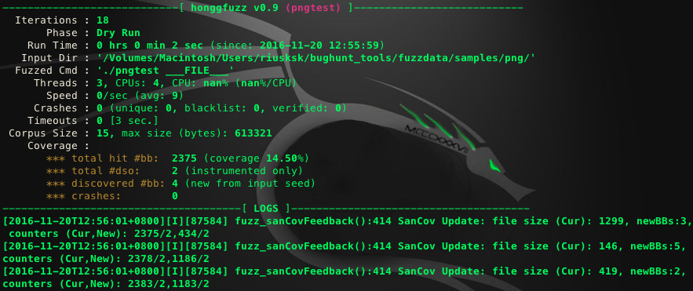

# honggfuzz #

**Description**

  * A general-purpose, easy-to-use fuzzer with interesting analysis options. See [USAGE](https://github.com/google/honggfuzz/blob/master/docs/USAGE.md) for details
  * Supports several hardware-based (CPU) and software-based [feedback-driven fuzzing](https://github.com/google/honggfuzz/blob/master/docs/FeedbackDrivenFuzzing.md) methods
  * It works (at least) under GNU/Linux, FreeBSD, Mac OS X, Windows/CygWin and [Android](https://github.com/google/honggfuzz/blob/master/docs/Android.md)
  * Supports persistent modes of fuzzing (long-lived process calling a fuzzed API repeatedly) with libhfuzz
  * [Can fuzz standalone long-lasting processes](https://github.com/google/honggfuzz/blob/master/docs/AttachingToPid.md) (e.g. network servers like Apache's httpd and ISC's bind)

**Code**

  * Latest version: [0.8](https://github.com/google/honggfuzz/releases/tag/0.8)
  * [Changelog](https://github.com/google/honggfuzz/blob/master/CHANGELOG)

**Requirements**

  * **Linux** - The BFD library (libbfd-dev) and libunwind (libunwind-dev/libunwind8-dev)
  * **FreeBSD** - gmake
  * **Android** - Android SDK/NDK. Also see [this detailed doc](https://github.com/google/honggfuzz/blob/master/docs/Android.md) on how to build and run it
  * **Windows** - CygWin
  * if **Clang/LLVM** is used - the BlocksRuntime Library (libblocksruntime-dev)

**Trophies**

The tool has been used to find a few interesting security problems in major software packages; Examples:

  * FreeType 2:
   * [CVE-2010-2497](https://bugzilla.redhat.com/show_bug.cgi?id=CVE-2010-2497), [CVE-2010-2498](https://bugzilla.redhat.com/show_bug.cgi?id=CVE-2010-2498), [CVE-2010-2499](https://bugzilla.redhat.com/show_bug.cgi?id=CVE-2010-2499), [CVE-2010-2500](https://bugzilla.redhat.com/show_bug.cgi?id=CVE-2010-2500), [CVE-2010-2519](https://bugzilla.redhat.com/show_bug.cgi?id=CVE-2010-2519), [CVE-2010-2520](https://bugzilla.redhat.com/show_bug.cgi?id=CVE-2010-2520), [CVE-2010-2527](https://bugzilla.redhat.com/show_bug.cgi?id=CVE-2010-2527)
  * [Multiple bugs in the libtiff library](http://bugzilla.maptools.org/buglist.cgi?query_format=advanced;emailreporter1=1;email1=robert@swiecki.net;product=libtiff;emailtype1=substring)
  * [Multiple bugs in the librsvg library](https://bugzilla.gnome.org/buglist.cgi?query_format=advanced;emailreporter1=1;email1=robert%40swiecki.net;product=librsvg;emailtype1=substring)
  * [Multiple bugs in the poppler library](http://lists.freedesktop.org/archives/poppler/2010-November/006726.html)
  * [Multiple exploitable bugs in IDA-Pro](https://www.hex-rays.com/bugbounty.shtml)
  * [Use-after-free in OpenSSL - CVE-2016-6309](https://www.openssl.org/news/secadv/20160926.txt)
  * [Pre-auth crash in OpenSSH](https://anongit.mindrot.org/openssh.git/commit/?id=28652bca29046f62c7045e933e6b931de1d16737)
  * ... and more

**Other**

This is NOT an official Google product.
